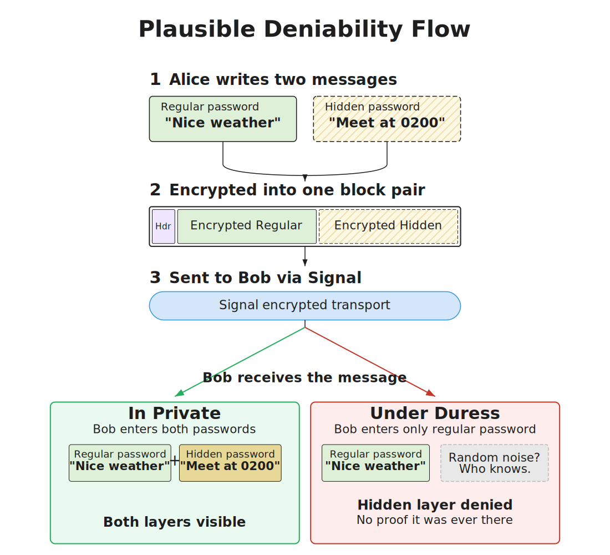
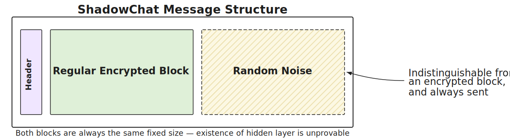
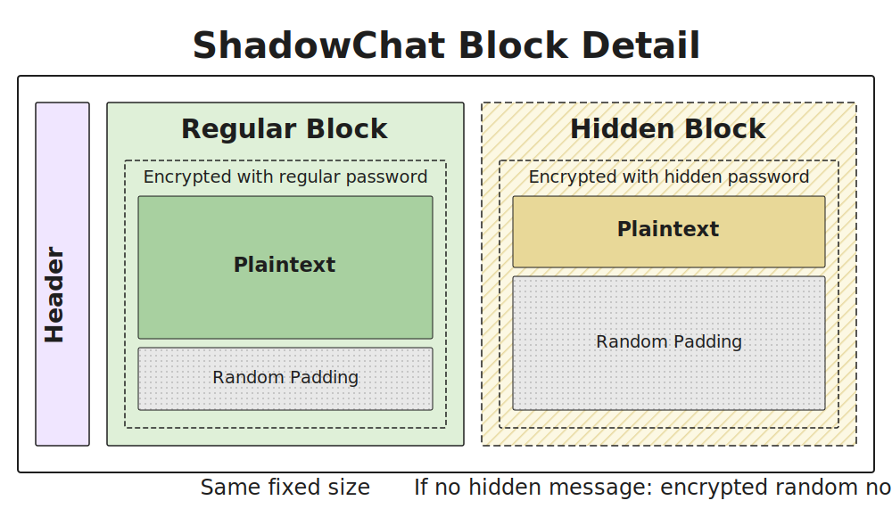
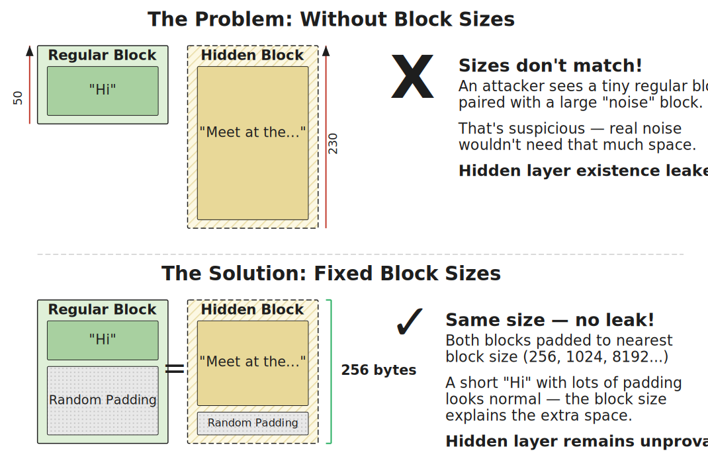

# ShadowChat

**Plausibly deniable encrypted messaging**, inspired by VeraCrypt's hidden volumes — built on top of Signal.

ShadowChat adds a dual-layer encryption scheme to Signal messages. A **regular layer** carries everyday conversation, while an optional **hidden layer** carries sensitive content. The system is designed so that it is fundamentally impossible to prove whether a hidden layer exists.

> This project is not associated with the Signal Technology Foundation, or Signal in any way.

---

## How It Works

ShadowChat leverages Signal to establish secure message delivery channels. The message content itself is protected using password-based dual-layer encryption — passwords are never stored on-device, so even full device compromise reveals nothing without them.

### Regular Use

1. You and your contact agree on a shared password.
2. Messages are encrypted with that password before being sent over Signal.

### Hidden Layer Use

1. You and your contact agree on a **regular password** and a **hidden password**.
2. Sensitive messages are encrypted with the hidden password; a decoy message is encrypted with the regular password.
3. Both layers are sent together as a single message that is indistinguishable from a regular-only message.
4. Under duress, you reveal only the regular password — the decoy content is shown, and the existence of any hidden layer cannot be proven or disproven.

<p align="center">
  
</p>

---

## Cryptographic Design

### Encryption Model

Password-based encryption is used rather than public-key cryptography. This means no decryption keys exist on the device — an attacker with full access to the host machine still cannot decrypt messages without knowing the passwords.

| Component | Choice |
|---|---|
| **Key Derivation** | Argon2id (memory-hard, side-channel resistant) |
| **Authenticated Encryption** | XChaCha20-Poly1305 (AEAD) |
| **Salt** | 16-byte random per message |
| **Nonce** | 24-byte random per block |

Keys are derived with Argon2id using the per-message salt and a layer-specific label (`shadowchat:v1:block:regular` or `shadowchat:v1:block:hidden`) for domain separation. The AEAD's additional authenticated data (AAD) binds ciphertext to both the envelope header and the intended layer.

### Security Properties

- **Confidentiality** — XChaCha20-Poly1305 with Argon2id KDF
- **Hidden layer deniability** — No way to distinguish whether a hidden layer exists, even with access to the host machine
- **Compromise resistance** — Password-based key derivation; no keys stored on disk
- **Transit security** — Messages in transit are additionally protected by Signal's protocol

> **Note:** Forward secrecy is not applicable in this model. Password-based encryption means that knowledge of the password can decrypt past messages if the ciphertext is available.

### Message Structure

Each message is a Base64-encoded envelope containing an unencrypted header followed by a block pair (regular block + hidden block):

<p align="center">
  
</p>

The **envelope header** (20 bytes, unencrypted) contains:
- Magic bytes (`SC`) — 2 bytes
- Protocol version — 2 bytes
- Per-message salt — 16 bytes

Each **block** contains:
- 24-byte nonce
- Ciphertext (same length as plaintext block size)
- 16-byte authentication tag

<p align="center">
  
</p>

### Block Sizes

To prevent message size from revealing the existence of a hidden layer, every message contains both a regular block and a hidden block of the **same size**. Block sizes scale in tiers:

| Tier | Block Size |
|---|---|
| 1 | 256 bytes |
| 2 | 1,024 bytes |
| 3 | 8,192 bytes |
| 4 | 65,536 bytes |
| 5 | 524,288 bytes |

The smallest block size that can accommodate the content (plaintext + 4-byte payload header) is selected. When a hidden message is present, the decoy message must be large enough to require the same block tier — this is enforced by validation. Unused space within a block is filled with random noise, which is indistinguishable from encrypted content.

<p align="center">
  
</p>

---

## Building

ShadowChat is an Android application. To build:

```sh
./gradlew assembleDebug
```

---

## Disclaimer

THE SOFTWARE IS PROVIDED "AS IS", WITHOUT WARRANTY OF ANY KIND, EXPRESS OR IMPLIED, INCLUDING BUT NOT LIMITED TO THE WARRANTIES OF MERCHANTABILITY, FITNESS FOR A PARTICULAR PURPOSE AND NONINFRINGEMENT. IN NO EVENT SHALL THE AUTHORS OR COPYRIGHT HOLDERS BE LIABLE FOR ANY CLAIM, DAMAGES OR OTHER LIABILITY, WHETHER IN AN ACTION OF CONTRACT, TORT OR OTHERWISE, ARISING FROM, OUT OF OR IN CONNECTION WITH THE SOFTWARE OR THE USE OR OTHER DEALINGS IN THE SOFTWARE.
