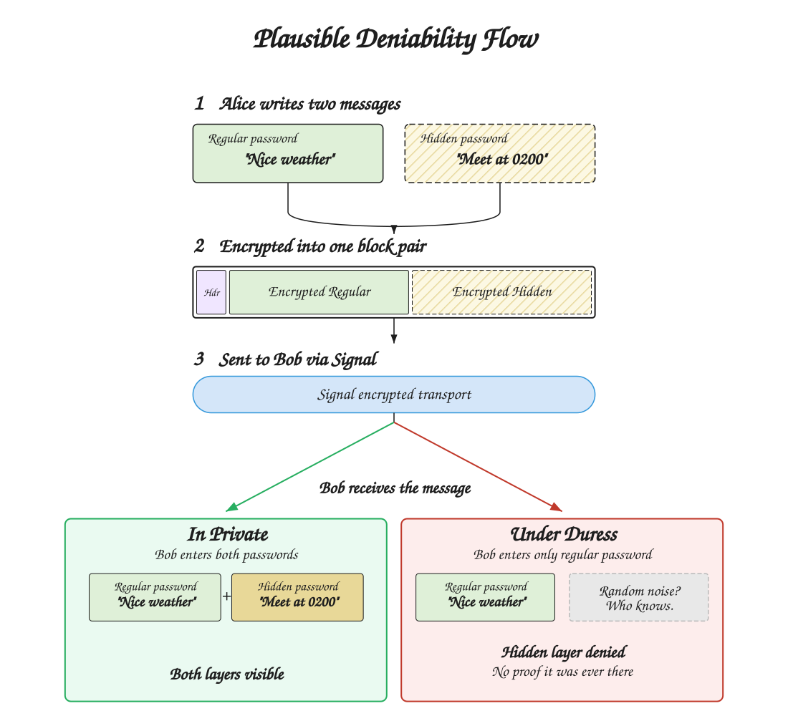
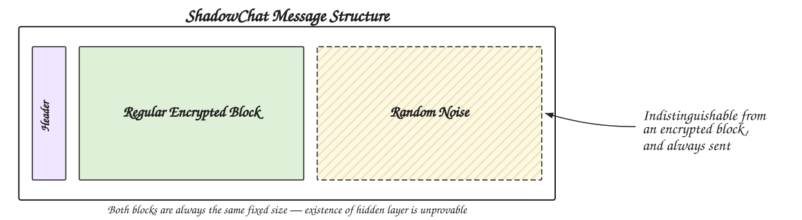
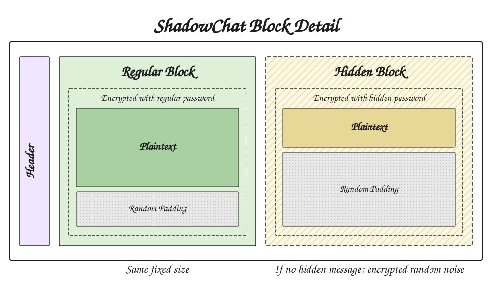
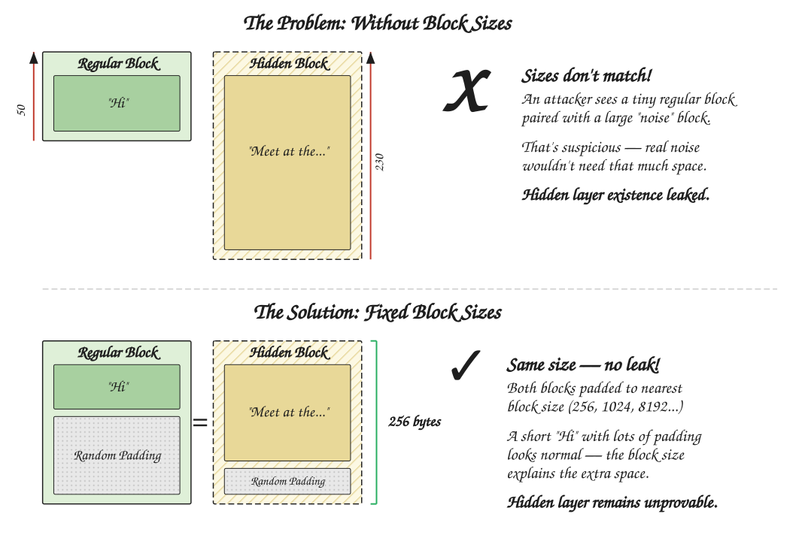

# ShadowChat

A design for an extortion-proof messaging algorithm, inspired by VeraCrypt's hidden volumes — built on top of Signal.

ShadowChat adds password protection to Signal messages. When ShadowChat mode is enabled, messages will be encrypted with a chosen password, adding a layer of protection to Signal.

ShadowChat has an optional feature to enable extortion-proof messaging. Both VeraCrypt and ShadowChat work on the same principle: a plausibly deniable hidden layer.

A **regular layer** carries everyday conversation, while an optional **hidden layer** carries sensitive content. The system is designed so that it is impossible to prove whether a hidden layer exists in a given conversation.

> This project is not associated with the Signal Technology Foundation, or Signal in any way.

---

## How It Works

ShadowChat leverages Signal to establish secure message delivery channels. The message content itself is protected using password-based dual-layer encryption — passwords are never stored on-device, so even full device compromise reveals nothing without them.

### Regular Use

1. You and your contact agree on a shared password.
2. Messages are encrypted with that password before being sent over Signal.

### Hidden Layer Use

1. You and your contact agree on a **regular password** and a **hidden password**.
2. Sensitive messages are encrypted with the hidden password; a decoy message is encrypted with the regular password.
3. Both layers are sent together as a single message that is indistinguishable from a regular-only message.
4. Under duress, you reveal only the regular password — the decoy content is shown, and the existence of any hidden layer cannot be proven or disproven.

<p align="center">
  
</p>

---

## Cryptographic Design

### Message Structure

#### Regular-only messages
Each message is a Base64-encoded envelope containing an unencrypted header followed by a block pair (regular block + hidden block).

In the case where only one password is used, the regular block is used to store the encrypted contents of the message. This is paired with an identically sized hidden layer, which is formed of encrypted random noise.

Regardless of whether the hidden layer functionality is used, this additional layer is always sent, making it indistinguishable from messages using the hidden layer.

<p align="center">
  
</p>

#### Extortion-proof mode

When two passwords are used, the user types two messages, which are encrypted with the regular password and hidden password respectively. Both of the messages are sent together, and are padded to be the exact same size. The image below shows how this looks in practice:


<p align="center">
  
</p>

### Block Sizes

To prevent message size from revealing the existence of a hidden layer, every message contains both a regular block and a hidden block of the **same size**.

The smallest block size that can accommodate the regular message is selected. When a hidden message is present, the regular message must require either the same block tier or larger, which is enforced by client-side validation. This ensures that longer hidden messages do not expose the existence of the hidden layer (see image below). Unused space within a block is filled with random noise, which is indistinguishable from encrypted content.

<p align="center">
  
</p>

---

## Building

ShadowChat is an Android application. To build:

```sh
./gradlew assembleDebug
```

---

## Disclaimer

THE SOFTWARE IS PROVIDED "AS IS", WITHOUT WARRANTY OF ANY KIND, EXPRESS OR IMPLIED, INCLUDING BUT NOT LIMITED TO THE WARRANTIES OF MERCHANTABILITY, FITNESS FOR A PARTICULAR PURPOSE AND NONINFRINGEMENT. IN NO EVENT SHALL THE AUTHORS OR COPYRIGHT HOLDERS BE LIABLE FOR ANY CLAIM, DAMAGES OR OTHER LIABILITY, WHETHER IN AN ACTION OF CONTRACT, TORT OR OTHERWISE, ARISING FROM, OUT OF OR IN CONNECTION WITH THE SOFTWARE OR THE USE OR OTHER DEALINGS IN THE SOFTWARE.
